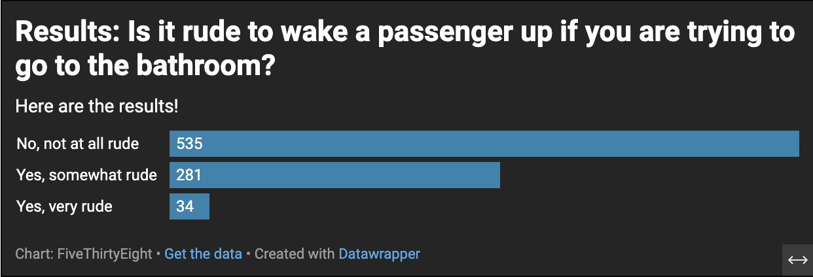

# FlyingEtiquette
Data about Flying Etiquette for J124

##Why I choose this question? 

##What I found intersting about this dataset?

##What does the chart reveal? 

Someone once told me the following quote: 

>Don't let your fears stand
>in the way of your dreams.
<ins> This will be underlined </ins>
This will have a  ~~strikethrough~~

This is a chart I made based on this question.  

